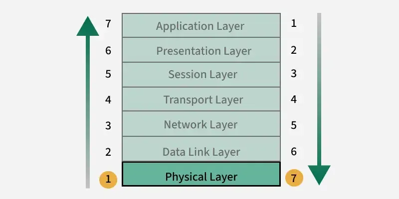
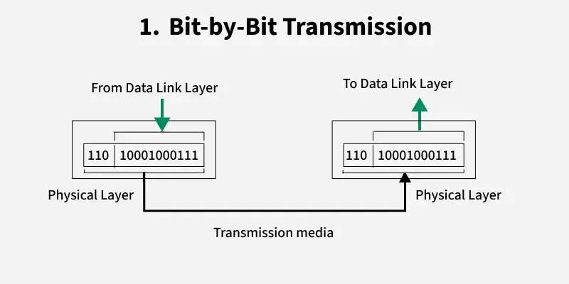
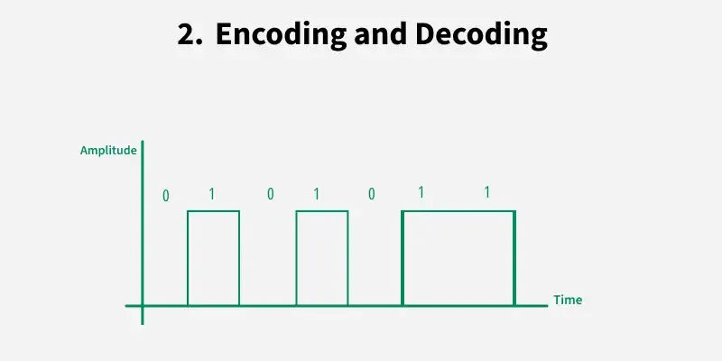
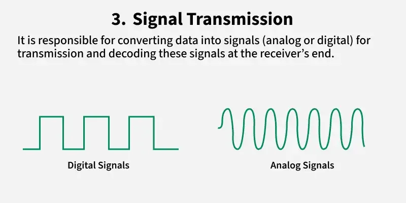
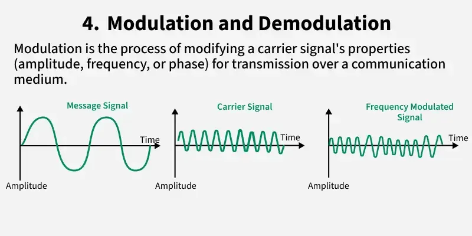

# Physical layer
https://www.geeksforgeeks.org/computer-networks/physical-layer-in-osi-model/

The physical Layer is the bottom-most layer in the Open System Interconnection (OSI) Model, responsible for the physical and electrical transmission of data. It consists of various network components such as power plugs, connectors, receivers, cable types, etc. The physical layer sends data bits from one device(s) (like a computer) to another device(s).

## Functions of Physical Layer
* The Physical Layer is responsible for sending raw data as bits over a physical medium.

* It converts data into signals that can travel through wires, fiber optics, or wireless channels (encoding) and turns these signals back into data at the receiver (decoding).

* It ensures signals are transmitted correctly and uses techniques like modulation to prepare the data for transmission and demodulation to retrieve it at the other end.

* This layer also decides how data flows (one-way, two-way alternately, or simultaneously) through transmission modes and controls the speed and timing of data transmission to keep everything running smoothly.

## Physical Topologies
Physical topologies describe the physical arrangement of devices and cables in a network. 

## Protocols in Physical Layer
Typically, a combination of hardware and software programming makes up the physical layer. It consists of several protocols that control data transmissions on a network. The following are some examples of Layer 1 protocols:

- Ethernet (IEEE 802.3)
- Wi-Fi (IEEE 802.11)
- Bluetooth (IEEE 802.15.1)
- USB (Universal Serial Bus)

## Need of Physical Layer in Security
In security, Physical Layer is essential because many attacks can occur before any software is involved. Threats at this level target the actual hardware or transmission medium.

- Cable Tapping
- Physical Access
- Wireless Signal Interception
- Signal Jamming
Hardware Manipulation

## Pros of the Physical Layer
- It ensures devices can transmit and receive raw data over physical mediums.
- It provides universal standards for cables, connectors, and signaling, ensuring compatibility.
- Support for Various Media

## Limitations of the Physical Layer
- No Error Handling
- Susceptible to Physical Damage
- No Data Interpretation
