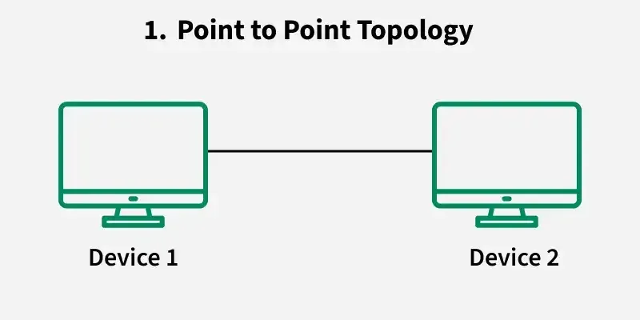
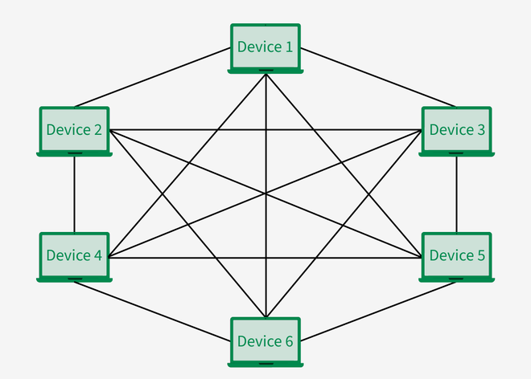
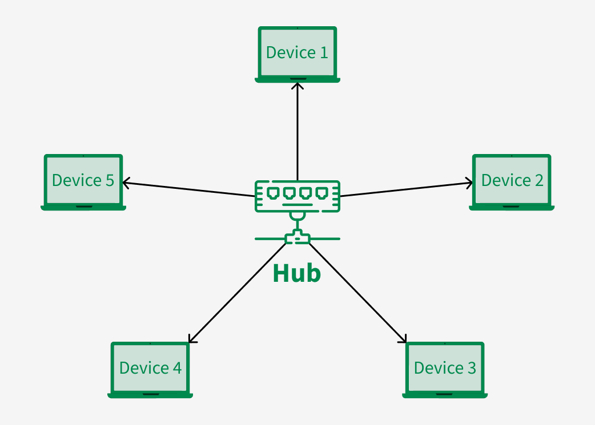
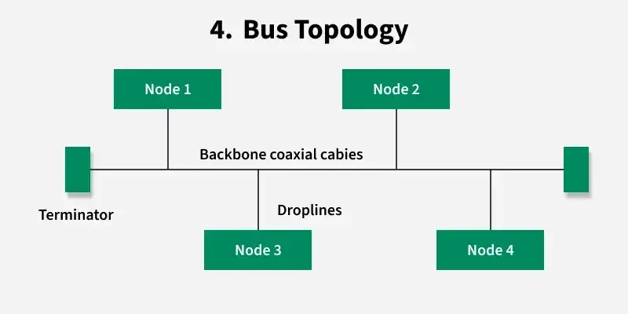
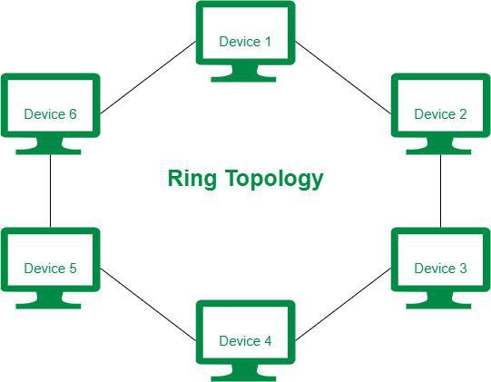
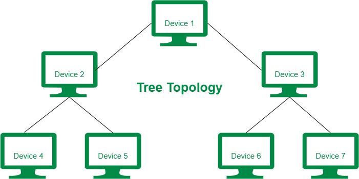

# Types of Network Topology
https://www.geeksforgeeks.org/computer-networks/types-of-network-topology/

A network topology is the arrangement of devices (nodes) and connections (links) in a computer network. It shows how computers, servers, and other devices are connected and how data flows between them. There are two main types of topology:

- Physical Topology: The actual physical layout of cables and devices.
- Logical Topology: How data moves across the network, regardless of physical layout.

## Point to Point Topology
Point-to-point topology is a type of topology that works on the functionality of the sender and receiver. 

## Mesh Topology
In a mesh topology, every device is connected to another device via a particular channel. Every device is connected to another via dedicated channels. 

## Star Topology
In Star Topology, all the devices are connected to a single hub through a cable. This hub is the central node and all other nodes are connected to the central node. 

## Bus Topology
Bus Topology is a network type in which every computer and network device is connected to a single cable. It is bi-directional. 

## Ring Topology
In a Ring Topology, it forms a ring connecting devices with exactly two neighboring devices. 

## Tree Topology
Tree topology is the variation of the Star topology. This topology has a hierarchical flow of data. 

