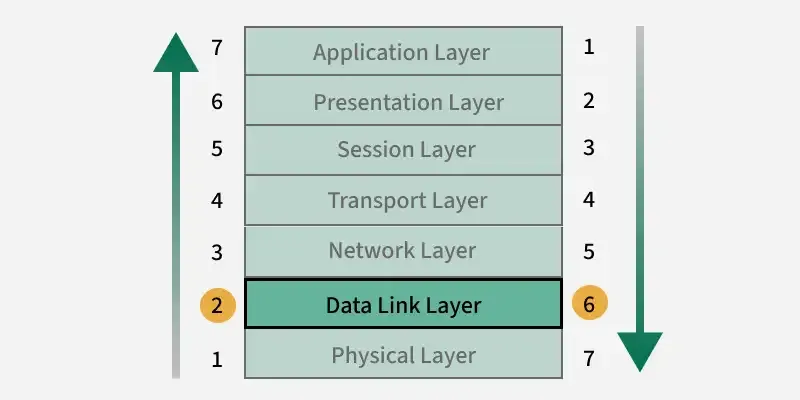
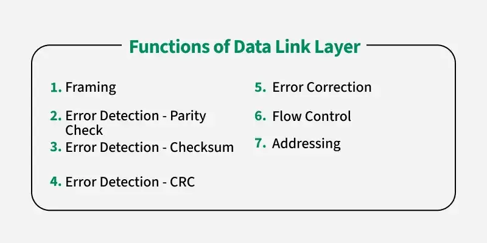
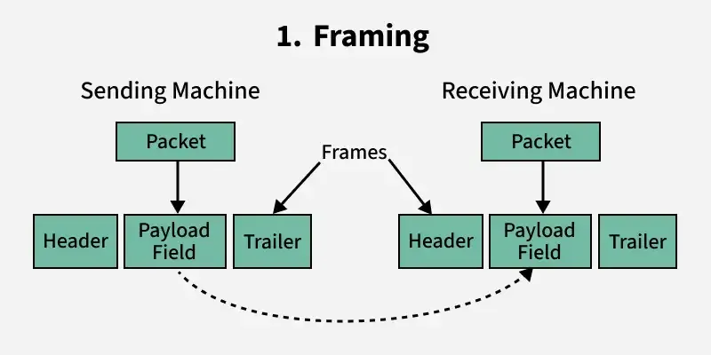
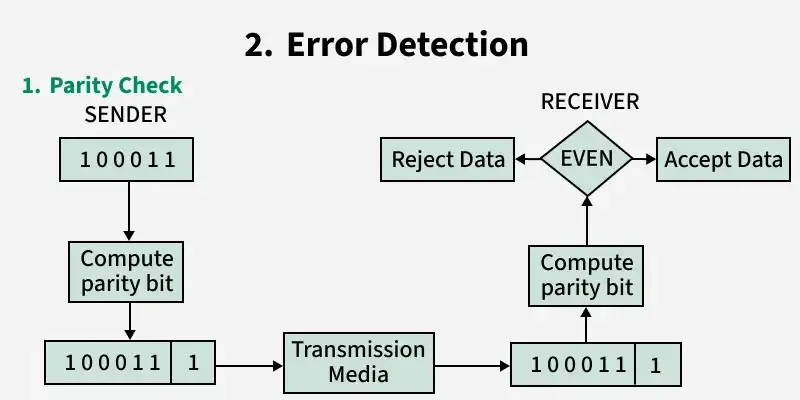
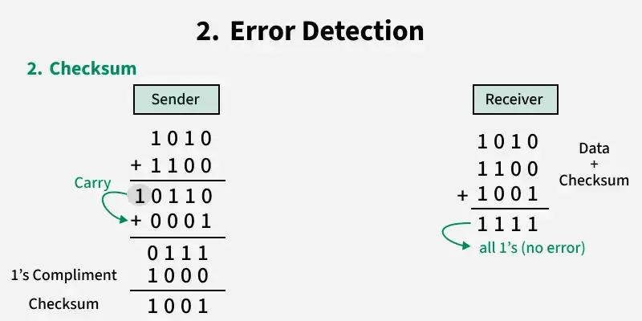
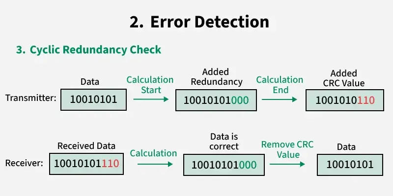
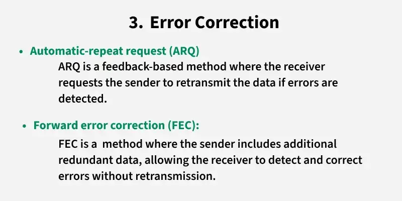
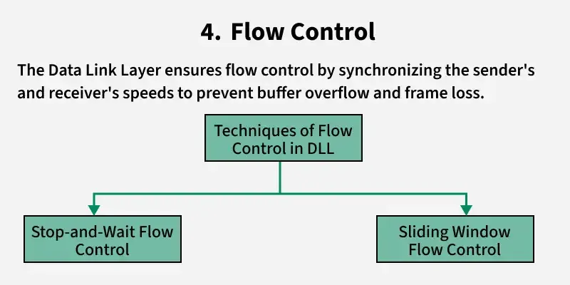
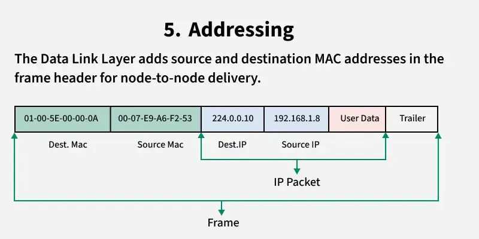
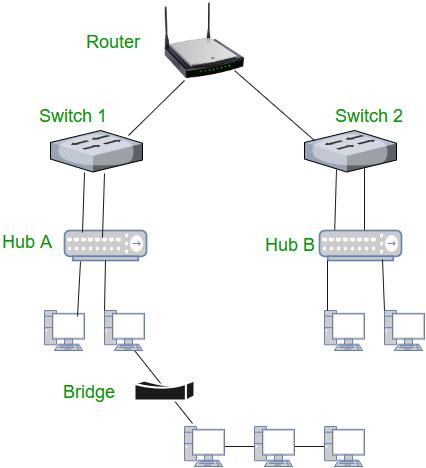

# Data Link Layer in OSI Model
https://www.geeksforgeeks.org/computer-networks/data-link-layer/

The data link layer is the second layer from the bottom in the OSI (Open System Interconnection) network architecture model.

- Responsible for the node-to-node delivery of data within the same local network.
- Major role is to ensure error-free transmission of information.
- Also responsible for encoding, decoding, and organizing the outgoing and incoming data.
- Considered as the most complex layer of the OSI model as it hides all the underlying complexities of the hardware from the other above layers. 

## Sub-Layers of The Data Link Layer
The data link layer is further divided into two sub-layers, which are as follows:

- Logical Link Control (LLC): This sublayer of the data link layer deals with multiplexing, the flow of data among applications and other services, and LLC is responsible for providing error messages and acknowledgments as well. 
- Media Access Control (MAC): MAC sublayer manages the device's interaction, responsible for addressing frames, and also controls physical media access. The data link layer receives the information in the form of packets from the Network layer, it divides packets into frames and sends those frames bit-by-bit to the underlying physical layer. 

## Functions of The Data-link Layer

## Devices Operating at the Data Link Layer
All these devices rely on MAC addresses for efficient frame delivery and play a crucial role in local network communication and access control.

1. Switch
- A switch is a key device in the Data Link Layer.
- It uses MAC addresses to forward data frames to the correct device within a network.
- Works in local area networks (LANs) to connect multiple devices.
2. Bridge
- A bridge connects two or more LANs, creating a single, unified network.
- Operates at the Data Link Layer by forwarding frames based on MAC addresses.
- Used to reduce network traffic and segment a network.
3. Network Interface Card (NIC)
- A NIC is a hardware component in devices like computers and printers.
- Responsible for adding the MAC address to frames and ensuring proper communication with the network.
- Operates at the Data Link Layer by preparing and sending frames over the physical medium.
4. Wireless Access Point (WAP)
- A WAP allows wireless devices to connect to a wired network.
- Operates at the Data Link Layer by managing wireless MAC addresses.
- Uses protocols like Wi-Fi (IEEE 802.11) to communicate with devices.
5. Layer 2 Switches
- These are specialized switches that only operate at Layer 2, unlike multi-layer switches.
- Responsible for frame forwarding using MAC address tables.
- Note: The Data Link Layer can be targeted by attacks like MAC spoofing or ARP poisoning. Understanding how devices and frames operate at this layer helps detect and mitigate such threats.

## Limitations of Data Link Layer
- Limited Scope: It operates only within a local network and cannot handle end-to-end communication across different networks.
- Increased Overhead: Adding headers, trailers, and redundant data (for error correction) increases the size of transmitted data.
- Error Handling Dependency: While it can detect and correct some errors, it relies on upper layers for handling more complex issues.
- No Routing Capability: The Data Link Layer cannot make routing decisions. It only ensures delivery within the same network segment.
- Resource Usage: Flow control and error correction mechanisms may consume extra processing power and memory