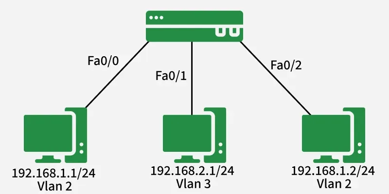

# Virtual LAN (VLAN)

https://www.geeksforgeeks.org/computer-networks/virtual-lan-vlan/

A Virtual Local Area Network (VLAN) is a logical segmentation of a Layer 2 (Data Link Layer) network that enables devices to be grouped together regardless of their physical location. Unlike traditional LANs that rely on physical topology, VLANs are implemented in switches using IEEE 802.1Q VLAN tagging.

By partitioning a single physical network into multiple broadcast domains, VLANs improve security, performance, flexibility, and manageability. Traditionally, routers (Layer 3 devices) were used to break up broadcast domains. However, VLANs enable switches to perform this segmentation at Layer 2.

- Same VLAN: Devices can communicate directly within the VLAN.
- Different VLANs: Communication requires Inter-VLAN Routing (using a router or Layer 3 switch).

## VLAN Ranges (Cisco Standard)
- VLAN 0 & 4095: Reserved, not usable.
- VLAN 1: Default VLAN; all switch ports belong here initially. Cannot be deleted.
- VLAN 2–1001: Normal VLAN range (configurable, editable, deletable).
- VLAN 1002–1005: Reserved for legacy Token Ring and FDDI.
- VLAN 1006–4094: Extended VLAN range.

## Pros of VLANs
- Improved Security: Sensitive traffic isolated within VLANs.
- Enhanced Performance: Reduces broadcast and multicast overhead.
- Simplified Management: Logical grouping of departments (e.g., HR, Finance).
- Flexibility: Devices can be reallocated without physical rewiring.
- Cost Savings: Eliminates need for excessive routers.
- Scalability: Networks can be segmented into manageable subnets.

## Cons of VLANs
- Increased configuration complexity.
- Scalability limitations due to VLAN ID restrictions.
- Security risks if VLAN hopping attacks are exploited.
- Interoperability issues with non-standard devices.
- Troubleshooting challenges due to isolated traffic flows.
