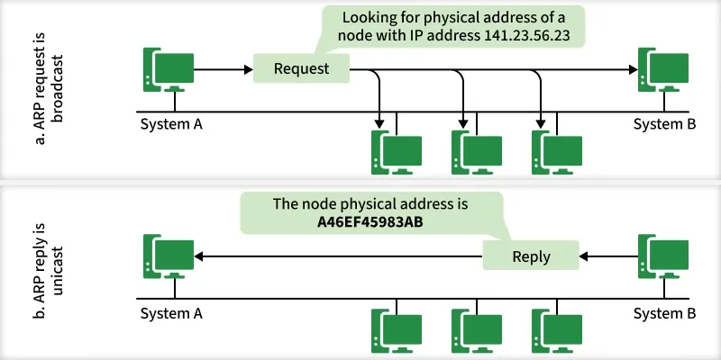
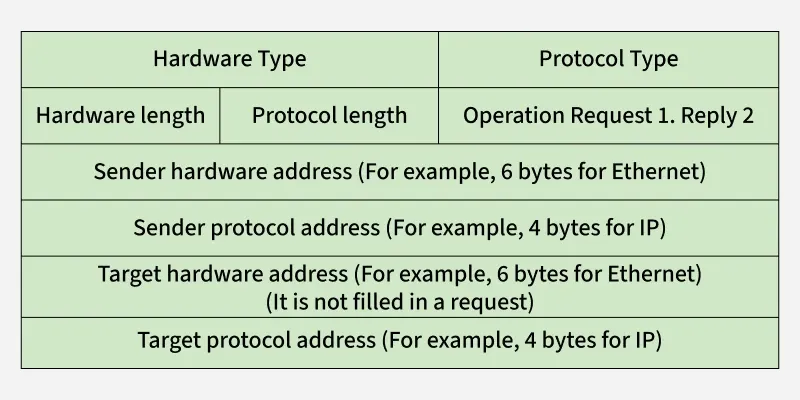

# Address Resolution Protocol - ARP

https://www.geeksforgeeks.org/computer-networks/arp-protocol/

ARP (Address Resolution Protocol) is a network protocol used to determine the MAC address (hardware address) corresponding to an IP address.

When one device in a LAN (Local Area Network) wants to communicate with another, it must know the destination’s MAC address.
Since users and applications work with IP addresses, ARP acts as the translator, converting IP addresses into MAC addresses.

## How ARP Works
- Sender checks ARP Cache: If the MAC address for the destination IP is already cached, communication starts immediately.
- ARP Request Broadcast: If not cached, the sender broadcasts an ARP request on the LAN.
- All Devices Receive Request: Each device checks whether the requested IP matches its own.
- Destination Replies: The device with the matching IP sends an ARP reply (unicast) containing its MAC address.
- Cache Update: The sender updates its ARP cache with the new MAC address for future use.

## ARP Message Format

- Hardware Type (2 bytes): Defines hardware (Ethernet = 1).
- Protocol Type (2 bytes): Defines protocol (IPv4 = 0x0800).
Hardware Address Length (1 byte): Length of MAC address (6 for Ethernet).
- Protocol Address Length (1 byte): Length of IP address (4 for IPv4).
- Operation Code (2 bytes): 1 for request, 2 for reply.
- Sender Hardware Address: MAC of the sender.
- Sender Protocol Address: IP of the sender.
- Target Hardware Address: Empty in request; receiver’s MAC in reply.
- Target Protocol Address: Receiver’s IP.