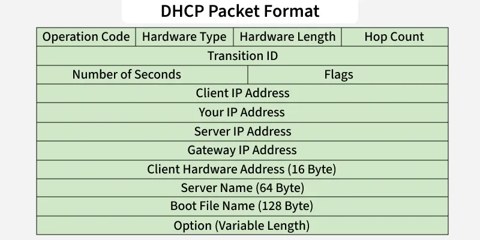

# Dynamic Host Configuration Protocol (DHCP)

https://www.geeksforgeeks.org/computer-networks/dynamic-host-configuration-protocol-dhcp/

Dynamic Host Configuration Protocol (DHCP) is a network protocol used to automate the process of assigning IP addresses and other network configuration parameters to devices such as computers, smartphones and printers. Instead of manually configuring each device, DHCP enables devices to join a network and automatically receive:

- IP Address
- Subnet Mask
- Default Gateway
- DNS Server addresses
- Other TCP/IP configuration options

## Components of DHCP
- DHCP Server: Stores IP addresses and configuration details. Allocates addresses dynamically to clients.
- DHCP Relay: Acts as a bridge between clients and servers when they are not on the same subnet.
- DHCP Client: A device (PC, phone, printer, etc.) that requests and receives network configuration from the DHCP server.
- IP Address Pool: A predefined range of IP addresses that the DHCP server can lease to devices.
- Subnets: Logical partitions of an IP network to organize and manage IP allocation.
- Lease: The time period for which an IP address is assigned to a client. After expiry, the client must renew or request a new lease.
- DNS Servers: DHCP can provide DNS server information to clients for resolving domain names.
- Default Gateway: The gateway router information is provided to clients so they can communicate outside their subnet.
- Options: Additional parameters like subnet mask, domain name and time servers.

## DHCP Packet Format
