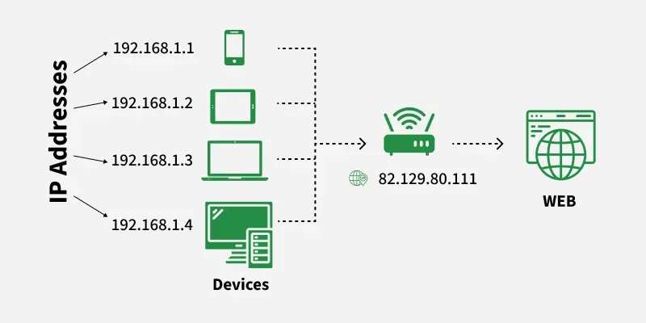
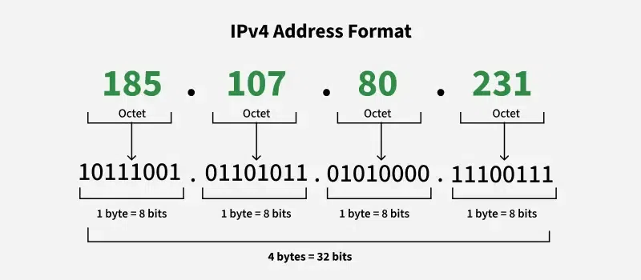
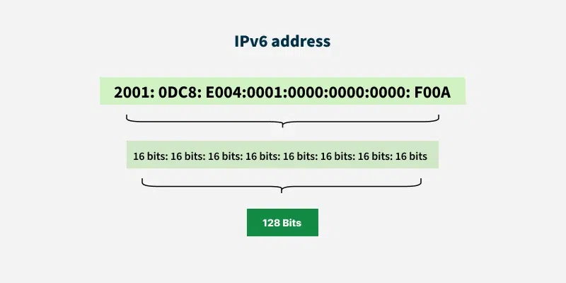
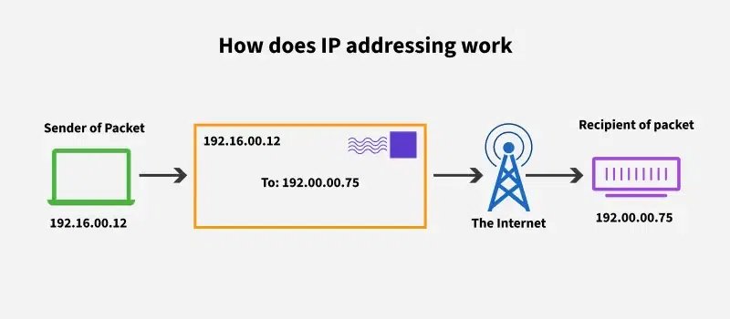
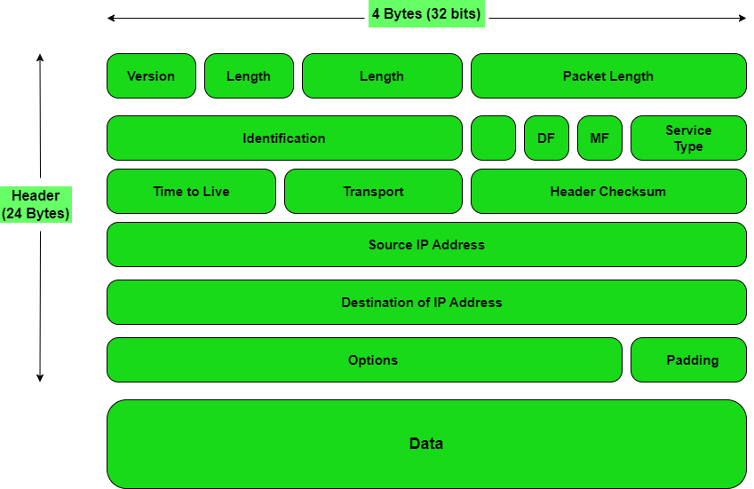

# IP
https://www.geeksforgeeks.org/computer-science-fundamentals/what-is-an-ip-address/

https://www.geeksforgeeks.org/computer-networks/what-is-internet-protocol-ip/

1. An IP Address (Internet Protocol Address) is a unique numerical label assigned to each device connected to a computer network that uses the Internet Protocol for communication. It serves two main purposes:
- Identifying a device on the network.
- Locating the device to enable communication with other devices over a network like the Internet.

2. Packet: A packet is a parcel of data that is switched between an origin and a destination via the Internet or some other network that is based on the packet switching mechanism. This component mainly has a header and a payload.

3. Router: A router is a network device that (serves as) a forwarding point for data packets between computer networks. Routers carry out the traffic routing functions through the Internet.

## Private (Local) IP Address: 
Private IP addresses are used within private networks and are not routable on the internet. This means that devices with private IP addresses cannot directly communicate with devices on the internet without a translating mechanism like a router performing Network Address Translation (NAT). These are only required to be unique within their own network & are used for communication between devices within the same network

- 10.0.0.0 - 10.255.255.255: (often used in larger networks)
- 172.16.0.0 - 172.31.255.255: (often used in larger networks)
- 192.168.0.0 - 192.168.255.255: (commonly used in home networks)
- 100.64.0.0 - 100.127.255.255: (for Carrier-Grade NAT)

## Public (Global) IP Address: 
A Public IP address is assigned to every device that directly accesses the internet. This address is unique across the entire internet. Uniqueness & Accessibility are its key characteristics & are assigned by Internet Service Providers. When you connect to the internet through an ISP, your device or router receives a public IP address. These addresses can be static or dynamic.

- 1.0.0.0 - 9.255.255.255
- 11.0.0.0 - 126.255.255.255
- 129.0.0.0 - 169.253.255.255
- 169.255.0.0 - 172.15.255.255
- 172.32.0.0 - 191.0.1.255
- 192.0.3.0 - 192.88.98.255
- 192.88.100.0 - 192.167.255.255
- 192.169.0.0 - 198.17.255.255
- 198.20.0.0 - 223.255.255.255 

## IPv4

This is the most common form of IP Address. It consists of four sets of numbers(octets) separated by dots. This format can support over 4 billion unique addresses. Each octet represents eight bits, or a byte, and can take a value from 0 to 255. This range is derived from the possible combinations of eight bits (28 = 256 combinations).

## IPv6

IPv6 addresses were created to deal with the shortage of IPv4 addresses. They use 128 bits instead of 32, offering a vastly greater number of possible addresses. These addresses are expressed as eight groups of four hexadecimal digits, each group representing 16 bits. The groups are separated by colons.

## Special IP Addresses
There are also some special-purpose IP addresses that don't follow the usual structure:

- Loopback Address: The loopback address 
127.0.0.1

127.0.0.1 is used to test network connectivity within the same device (i.e., sending data to yourself). Often called "localhost."

- Broadcast Address: The broadcast address allows data to be sent to all devices in a network. For a typical network with the IP range 
192.168.1.0/24

192.168.1.0/24, the broadcast address would be 

192.168.1.255.

- Multicast Address: Used to send data to a group of devices (multicast). For example, 
233.0.0.1
233.0.0.1 is a multicast address

# How Does IP Addressing Work?
Every device connected to a network (such as the internet or a local network) needs a unique identifier so it can be located and communicated with other devices. So, the IP address serves this purpose. IP addresses are used by routers to determine how to forward data packets across the internet or a local network. This is essential for the delivery of data between devices located in different geographical regions or network segments.

IP addressing uniquely identifies each device on a network using IPv4 or IPv6 addresses, assigned either statically or dynamically through DHCP. DNS translates human-readable domain names into these IP addresses, while protocols like ARP (for IPv4) or NDP (for IPv6) map IPs to physical MAC addresses locally. Data is encapsulated into IP packets containing source and destination addresses, which are routed through network devices using routing tables and protocols such as OSPF or BGP to reach their target. In private networks, NAT allows multiple devices to share a single public IP, conserving address space and enhancing security by hiding internal addresses. Upon reaching the destination, packets are decapsulated and processed by the appropriate applications. This comprehensive system ensures accurate, secure, and reliable data delivery across interconnected networks.

# What is an IP Packet?

An IP packets is the basic unit of data transmission in an IP network. It consists of a header and a payload:

- Header: The header contains essential control information, such as the source and destination IP addresses, that helps routers determine where to send the packet.
- Payload: The payload contains the actual data being transmitted. Once the packet reaches its destination, the data in the payload is delivered to the appropriate application or protocol

