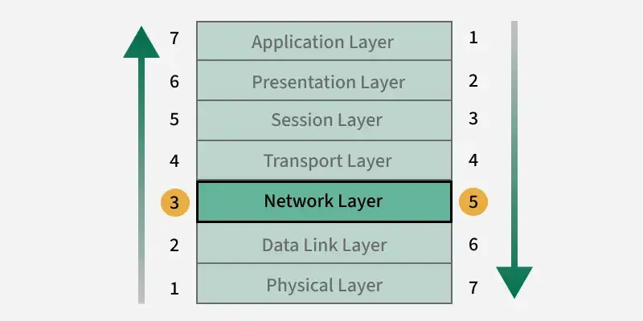
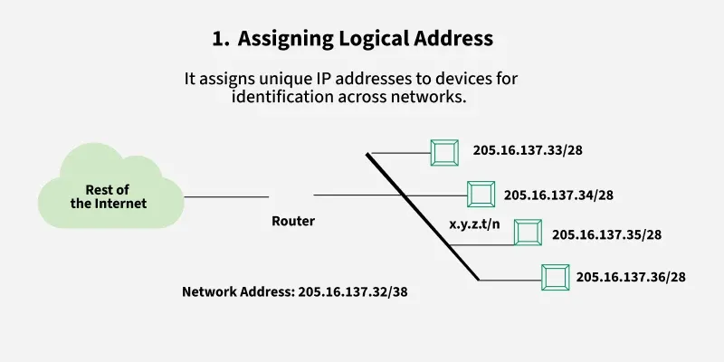
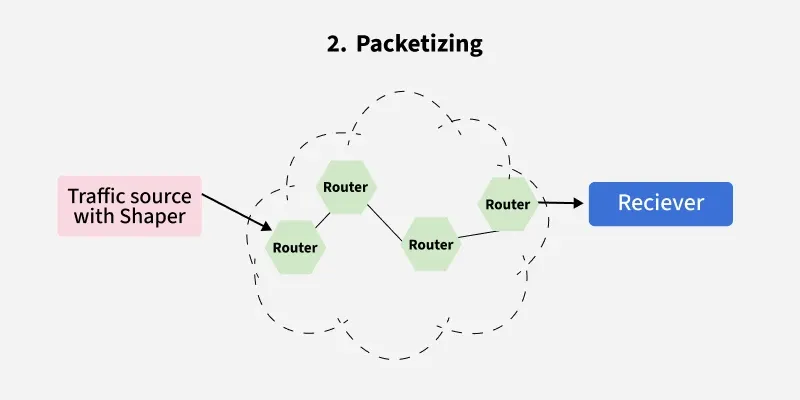
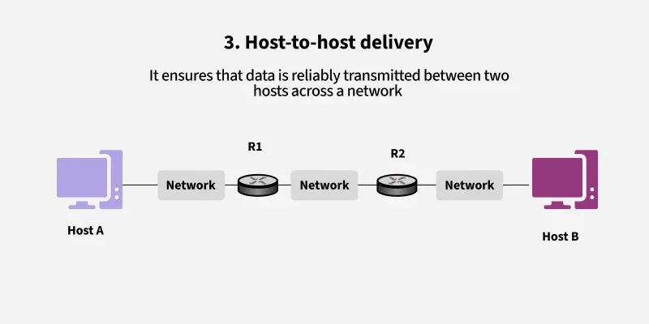
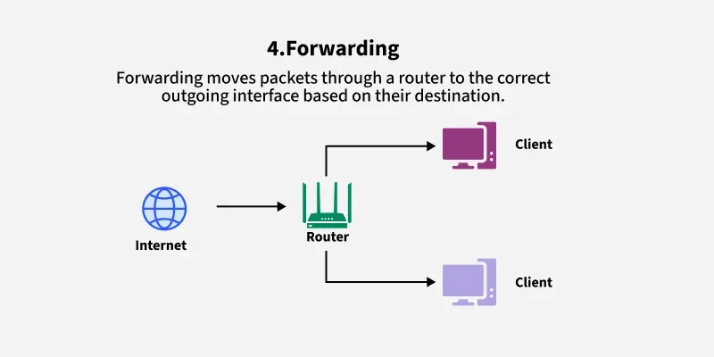
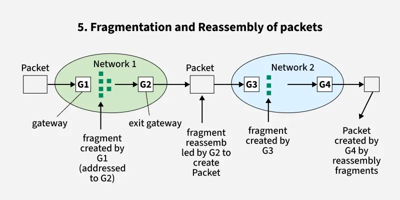
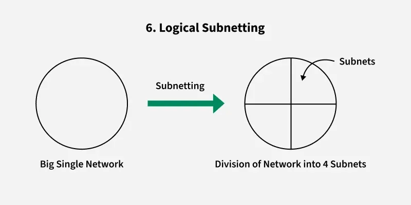
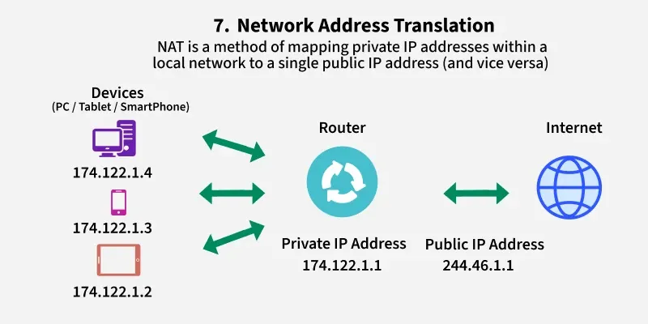
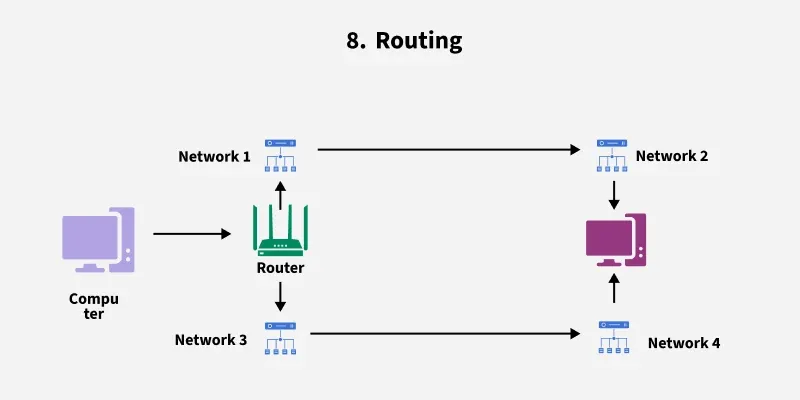

# Network Layer in OSI Model
https://www.geeksforgeeks.org/computer-networks/network-layer-in-osi-model/

Network Layer is the third layer from the bottom (Layer 3) and the fifth layer from the top in the OSI (Open Systems Interconnection) Model. It is responsible for ensuring end-to-end packet delivery across multiple interconnected networks.

## Key Responsibilities of the Network Layer

1. Logical Addressing: Assigns unique IP addresses to devices, ensuring accurate identification and communication across networks.

2. Packetization: Encapsulates transport layer segments into packets for efficient transmission.

3. Host-to-Host Delivery: Ensures reliable delivery of packets from the sender to the intended receiver across diverse networks.

4. Forwarding: Moves packets from the input interface of a router to the appropriate output interface based on the destination IP.

5. Fragmentation and Reassembly: Splits large packets into smaller fragments to match the maximum transmission unit (MTU) of a network, and reassembles them at the destination.

6. Subnetting: Divides larger networks into smaller subnetworks for efficient addressing and traffic management.

7. Network Address Translation (NAT): Maps private IPs to public IPs for internet communication, conserving address space and adding security.

8. Routing: Determines the optimal path for packets to travel across multiple networks using routing algorithms and protocols.

## How the Network Layer Works

- Each device is assigned a unique logical address (IP address).
- Data from the transport layer is encapsulated into packets, with source and destination IPs attached.
- Routers analyze the destination address and determine the best available path.
- Packets traverse the network hop-by-hop, moving across routers until reaching the destination.
- If the packet size exceeds the MTU, it is fragmented into smaller units.
- At the destination, the fragments are reassembled into the original data.
- If errors occur (e.g., unreachable destination), protocols like ICMP send error messages back to the source.