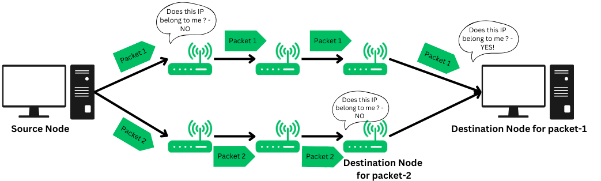

# Routing

https://www.geeksforgeeks.org/computer-networks/what-is-routing/

The process of choosing a path across one or more networks is known as Network Routing. Nowadays, individuals are more connected on the internet and hence, the need to use Routing Communication is essential.

Routing chooses the routes along which Internet Protocol (IP) packets get from their source to their destination in packet-switching networks. This article will discuss the details of the Routing Process along with its different types and working principles.

## What is Routing?

Routing refers to the process of directing a data packet from one node to another. It is an autonomous process handled by the network devices to direct a data packet to its intended destination. Note that, the node here refers to a network device called - 'Router'.

Routing is a crucial mechanism that transmits data from one location to another across a network (Network type could be any like LAN, WAN, or MAN). The process of routing involves making various routing decisions to ensure reliable & efficient delivery of the data packet by finding the shortest path using various routing metrics which we will be discussing in this article.

Routing of a data packet is done by analyzing the destination IP Address of the packet. Look at the below image:

The Source Node (Sender) sends the data packet on the network, embedding the IP in the header of the data packet.
The nearest router receives the data packet, and based on some metrics, further routes the data packet to other routers.
Step 2 occurs recursively till the data packet reaches its intended destination.

## What is the Working Principle of Routing?
Routing works by finding the shortest path from the source node to the destination node across a network. Here's the step-by-step working of routing:

### Step 1: Communication initiation
The first step that typically happens is, one node (client or server) initiates a communication across a network using HTTP protocols.

### Step 2: Data Packets
The source device now breaks a big chunk of information into small data packets for reliable and efficient transmission. This process is called de-assembling and encapsulating the data payload. Then each data packet is labeled with the destination node's IP address.

### Step 3: Routing Table
The Routing table is a logical data structure used to store the IP addresses and relevant information regarding the nearest routers. The source node then looks up the IP addresses of all the nodes that can transmit the packet to its destination selects the shortest path using the shortest path algorithm and then routes accordingly.

The Routing Table is stored in a router, a network device that determines the shortest path and routes the data packet.

### Step 4: Hopping procedure
In the procedure or routing, the data packet will undergo many hops across various nodes in a network till it reaches its final destination node. Hop count is defined as the number of nodes required to traverse through to finally reach the intended destination node.

This hopping procedure has certain criteria defined for every data packet, there's a limited number of hops a packet can take if the packet exceeds that, then it's considered to be lost and is retransmitted.

### Step 5: Reaching the destination node
Once all the data packets reach their intended destination node, they re-assemble and transform into complete information that was sent by the sender (source node). The receiver will perform various error-checking mechanisms to verify the authenticity of the data packets.

Overall, the data packet will be transmitted over the least hop-count path as well as the path on which there is less traffic to prevent packet loss.