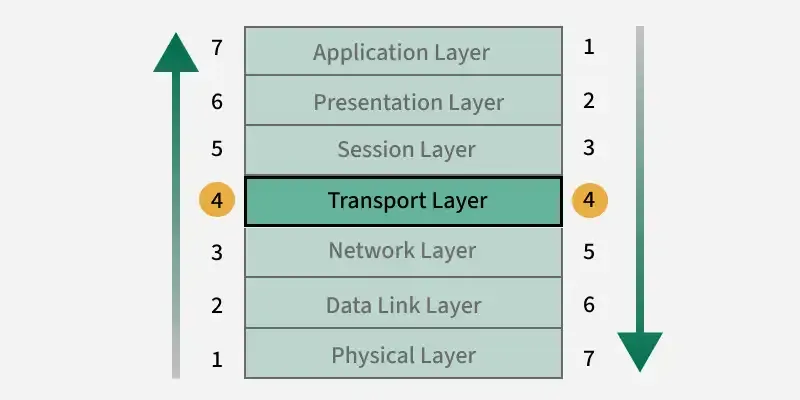
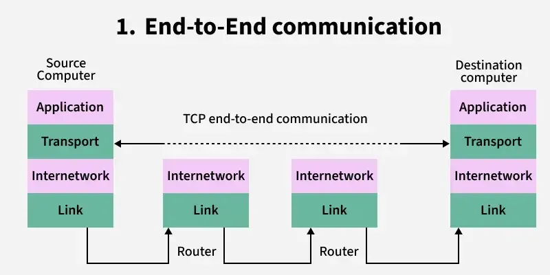
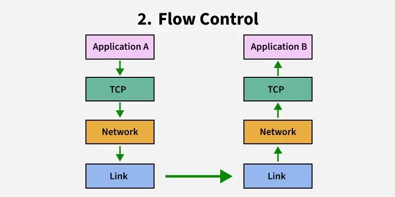
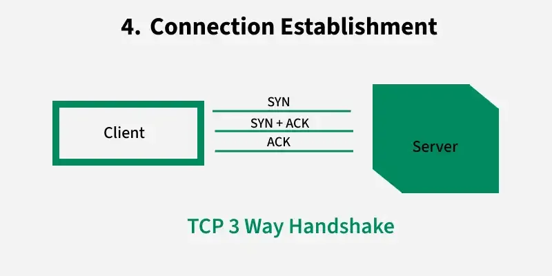
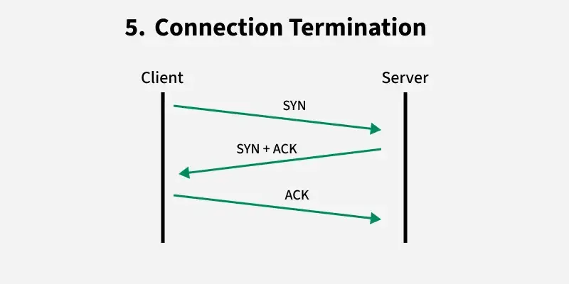
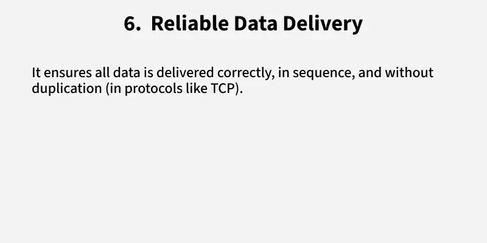

# Transport Layer in OSI Model

The Transport Layer ensures end-to-end communication between applications on different hosts. It sits between the Network Layer (which delivers packets to the right machine) and the Session Layer (which manages communication sessions). Its main job is to deliver data reliably, efficiently, and in the correct order.

## Functions of Transport Layer
The Transport Layer is responsible for end-to-end communication of data packets. It provides a number of important functions that are responsible for reliable, efficient, and organized data transfer between host systems in a networked environment.

## Working of Transport Layer
The Transport Layer provides logical communication between processes on different hosts — meaning that even though data travels across various physical networks, the communicating applications perceive a direct, reliable link.

## Difference Between TCP and UDP at Transport Layer

| TCP | UDP |
|-----|-----|
| TCP is a connection-oriented protocol | UDP is the connection-less protocol |
| TCP supports error-checking mechanisms. | UDP has only the basic error-checking mechanism using checksums. |
| An acknowledgment segment is present. | No acknowledgment segment. |
| TCP is slower than UDP | UDP is faster, simpler, and more efficient than TCP. |
| Retransmission of lost packets is possible in TCP, but not in UDP. | There is no retransmission of lost packets in the User Datagram Protocol (UDP) |
| TCP has a (20-60) bytes variable length header. | The header length is fixed of 8 bytes. |