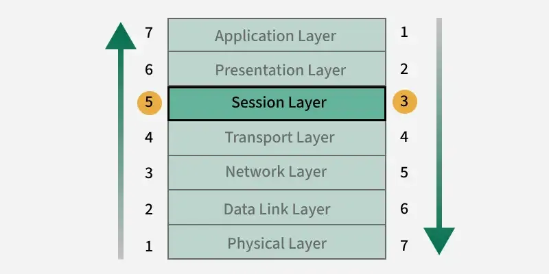
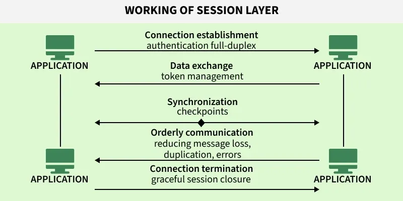

# Session Layer in OSI model

https://www.geeksforgeeks.org/computer-networks/session-layer-in-osi-model/

The Session Layer is the 5th layer of the OSI (Open Systems Interconnection) model and it helps in managing and controlling dialogues (sessions) between computers. It establishes, coordinates and terminates communication between applications on different devices, ensuring smooth and organized data exchange.

# Functions of the Session Layer
- Session Establishment: Initiates and negotiates communication parameters (e.g., authentication, duplex mode).
- Communication Synchronization: Keeps data streams in order using checkpoints.
- Activity & Dialog Management: Controls turns, prevents collisions, and avoids duplication.
- Resynchronization & Recovery: Recovers from failures using synchronization points.
- Session Termination: Gracefully ends communication after all data is exchanged.
