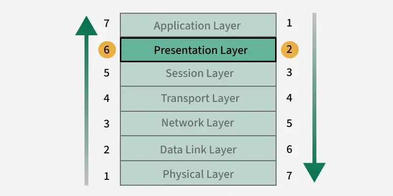

# Presentation Layer in OSI model

https://www.geeksforgeeks.org/computer-networks/presentation-layer-in-osi-model/

Presentation Layer is the sixth layer of the OSI (Open Systems Interconnection) model. It acts as a translator for the network, ensuring that the data exchanged between devices is in a format both systems can understand. Because of its role in ensuring proper data representation, this layer is often referred to as the Translation Layer or the Syntax Layer.

## Role of the Presentation Layer
When the Application Layer generates data, the Presentation Layer converts it into a standard form that can be transmitted across the network. Similarly, when data is received, it translates it into a format the receiving system can process.

Key highlights:
- Maintains proper syntax and semantics of the data.
- Provides encryption and decryption for secure communication.
- Applies compression techniques to optimize bandwidth usage.
- Ensures compatibility between different systems and devices.

## Functions of the Presentation Layer
- Data Translation
- Data Compression
- Data Encryption/Decryption
- Syntax and Semantics Management
- Transfer Syntax Negotiation
- Interoperability