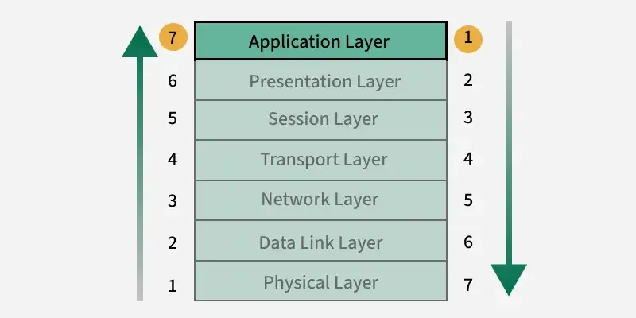
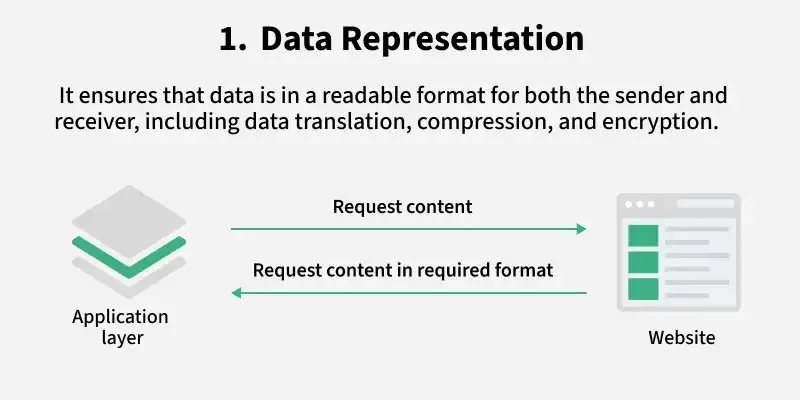
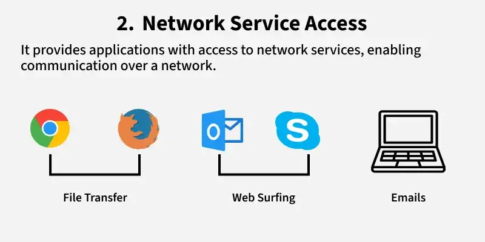
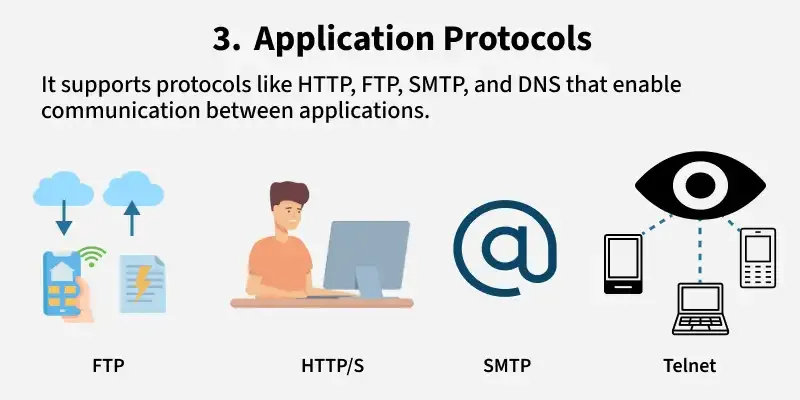
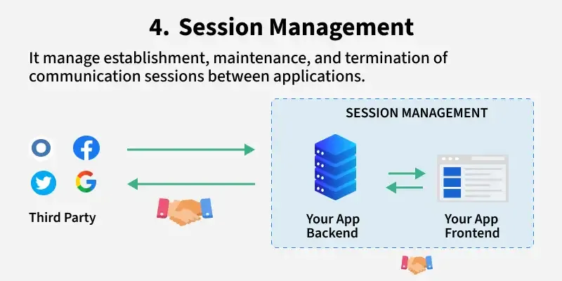
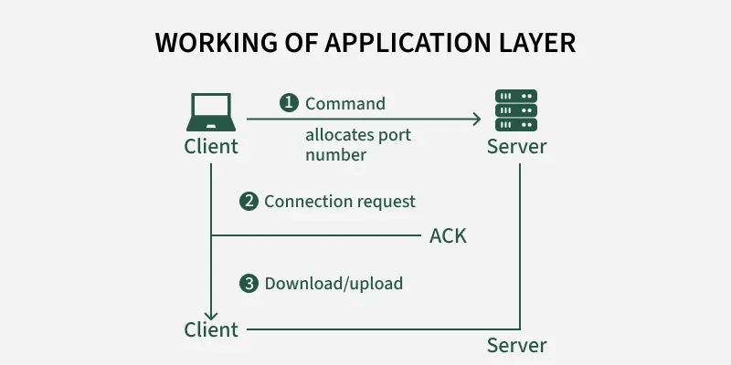

# Application Layer in OSI Model

https://www.geeksforgeeks.org/computer-networks/application-layer-in-osi-model/

Application Layer of OSI (Open System Interconnection) model, is the top layer in this model and takes care of network communication. It provides the functionality to send and receive data from users. It acts as the interface between the user and the application.

## Functions of Application Layer

## Working of Application Layer
Once the data exchange is complete, the client or server can terminate the session and the connection is closed gracefully.

- At first, client sends a command to server and when server receives that command, it allocates port number to client.
- Thereafter, the client sends an initiation connection request to server and when server receives request, it gives acknowledgement (ACK) to client through client has successfully established a connection with the server.
- Therefore, now client has access to server through which it may either ask server to send any types of files or other documents or it may upload some files or documents on server itself.