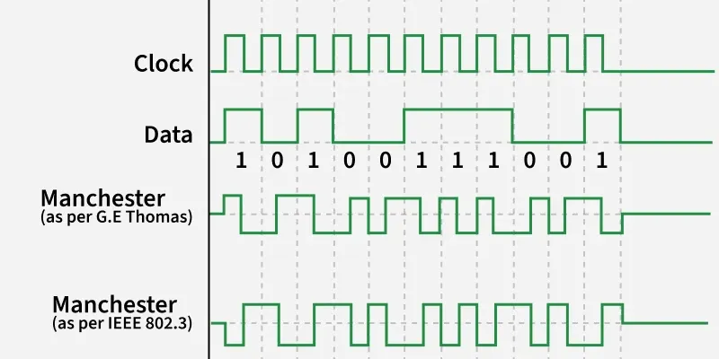

# Ethernet

https://www.geeksforgeeks.org/computer-networks/what-is-ethernet/

https://www.geeksforgeeks.org/computer-networks/ethernet-frame-format/

A Local Area Network (LAN) is a high-speed data communication system interconnecting devices within a limited scope such as offices or campuses. While LANs may use wired or wireless media, Ethernet (IEEE 802.3) dominates as the primary wired LAN standard. It provides standardized framing, efficient media access control, and scalable physical layer options, enabling reliable communication from 10 Mbps to multi-hundred-gigabit speeds.

# How Ethernet Works
Ethernet operates at the Physical Layer (Layer 1) and the Data Link Layer (Layer 2) of the OSI model.

- Protocol Data Unit (PDU): Frame (at Data Link Layer)
- Access Control Mechanism: CSMA/CD (Carrier Sense Multiple Access with Collision Detection) manages data collisions on shared media.
- Encoding Technique: Manchester Encoding, Bit '0' -> High - to - Low transition & Bit '1' -> Low - to - High transition

## Ethernet (IEEE 802.3) Frame Format

- PREAMBLE: Ethernet frame starts with a 7-Bytes Preamble. 
- Start of frame delimiter (SFD): This is a 1-Byte field that is always set to 10101011. SFD indicates that upcoming bits are starting the frame, which is the destination address. 
- Length: Length is a 2-Byte field, which indicates the length of the entire Ethernet frame. This 16-bit field can hold a length value between 0 to 65535, but length cannot be larger than 1500 Bytes because of some own limitations of Ethernet.
- Data: This is the place where actual data is inserted, also known as Payload . 
- Cyclic Redundancy Check (CRC): CRC is 4 Byte field. 
- VLAN Tagging: This tag allows network administrators to logically separate a physical network into multiple virtual networks, each with its own VLAN ID.
- Jumbo Frames: In addition to the standard Ethernet frame size of 1518 bytes, some network devices support Jumbo Frames, which are frames with a payload larger than 1500 bytes.
- Ether Type Field: The EtherType field in the Ethernet frame header identifies the protocol carried in the payload of the frame.
- Multicast and Broadcast Frames: In addition to Unicast frames (which are sent to a specific destination MAC address), Ethernet also supports Multicast and Broadcast frames. 
- Collision Detection: In half-duplex Ethernet networks, collisions can occur when two devices attempt to transmit data at the same time. 
