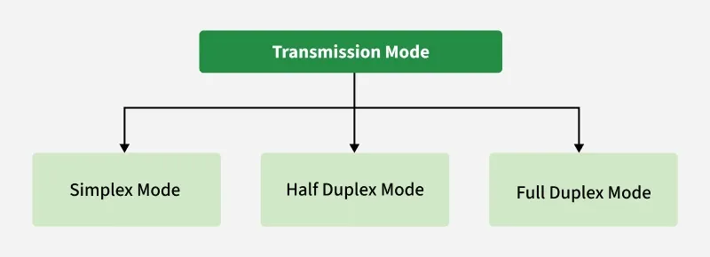

# Transmission Modes in Computer Networks 
https://www.geeksforgeeks.org/computer-networks/transmission-modes-computer-networks/

Transmission modes also known as communication modes, define how data is transferred between devices in a network or bus system. They are classified into three types: Simplex Mode, Half-Duplex Mode, and Full-Duplex Mode.

## Simplex Mode
In Simplex mode, the communication is unidirectional, as on a one-way street. Only one of the two devices on a link can transmit, the other can only receive. The simplex mode can use the entire capacity of the channel to send data in one direction. 

## Half-Duplex Mode
In half-duplex mode, each station can both transmit and receive, but not at the same time. When one device is sending, the other can only receive, and vice versa. The half-duplex mode is used in cases where there is no need for communication in both directions at the same time. The entire capacity of the channel can be utilized for each direction. 

Channel capacity = Bandwidth * Propagation Delay

# Full-Duplex Mode

In full-duplex mode, both stations can transmit and receive simultaneously. It is used when communication in both directions is required all the time. The capacity of the channel, however, must be divided between the two directions. Here, signals going in one direction share the capacity of the link with signals going in another direction, this sharing can occur in two ways: 

Either the link must contain two physically separate transmission paths, one for sending and the other for receiving.
Or the capacity is divided between signals traveling in both directions. 
Channel Capacity = 2 * Bandwidth * propagation Delay

