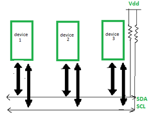

# I2C

https://www.geeksforgeeks.org/computer-organization-architecture/i2c-communication-protocol/

I2C stands for Inter-Integrated Circuit. It is a bus interface connection protocol incorporated into devices for serial communication. It was originally designed by Philips Semiconductor in 1982. Recently, it is a widely used protocol for short-distance communication. It is also known as Two Wired Interface(TWI).

Working of I2C Communication Protocol
It uses only 2 bi-directional open-drain lines for data communication called SDA and SCL. Both these lines are pulled high.

<b>Serial Data (SDA) </b>: Transfer of data takes place through this pin.
<b>Serial Clock (SCL) </b>: It carries the clock signal.

<b>I2C operates in 2 modes</b>

- Master mode
- Slave mode

Each data bit transferred on SDA line is synchronized by a high to the low pulse of each clock on the SCL line.

<b>Here are the steps of I2C (Inter-Integrated Circuit) data transmission</b>

- <b>Start Condition</b>: The master device sends a start condition by pulling the SDA line low while the SCL line is high. This signals that a transmission is about to begin.
- <b>Addressing the Slave:</b> The master sends the 7-bit address of the slave device it wants to communicate with, followed by a read/write bit. The read/write bit indicates whether it wants to read from or write to the slave.
- <b>Acknowledge Bit (ACK)</b>: The addressed slave device responds by pulling the SDA line low during the next clock pulse (SCL). This confirms that the slave is ready to communicate.
- <b>Data Transmission</b>: The master or slave (depending on the read/write operation) sends data in 8-bit chunks. After each byte, an ACK is sent to confirm that the data has been received successfully.
- <b>Stop Condition</b>: When the transmission is complete, the master sends a stop condition by releasing the SDA line to high while the SCL line is high. This signals that the communication session has ended.

<pre>
#include <stdint.h>

// Hardware-dependent function prototypes
void I2C_Init(void);
void I2C_Start(void);
void I2C_Stop(void);
void I2C_Write(uint8_t data);
uint8_t I2C_Read(uint8_t ack);

#define I2C_ACK  1
#define I2C_NACK 0

int main(void) {
    I2C_Init();

    I2C_Start();
    I2C_Write(0x50 << 1);     // Send device address (example: EEPROM at 0x50), Write mode
    I2C_Write(0x00);          // Send register address
    I2C_Write(0xAB);          // Send data
    I2C_Stop();

    I2C_Start();
    I2C_Write((0x50 << 1) | 1);  // Read mode
    uint8_t data = I2C_Read(I2C_NACK);
    I2C_Stop();

    while (1) {}
}
</pre>