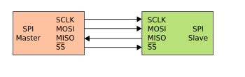
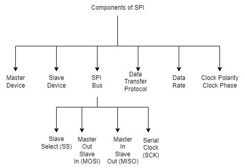

# SPI

https://www.geeksforgeeks.org/electronics-engineering/what-is-serial-peripheral-interface-spi/

SPI stands for Serial Peripheral Interface. It is a protocol that is synchronous serial communication. It is used to communicate between the peripheral devices i.e. input and output devices and microcontrollers. It is allowed to transfer high-speed data. It is popular with digital communication applications and embedded systems. SPI can transfer the data and receive data from one device to another device at a time.

Serial Peripheral Interface (SPI) is the process of synchronous serial communication protocol. It is mainly used for connecting the microcontrollers to peripheral devices like sensors, displays, and memory chips. It facilitates the full-duplex, synchronous serial communication between one or more slave devices and a microcontroller.

- <b>Master Device</b>: The master device is nothing but it controls the process of transformation of data on the SPI bus. It controls the data flow and it generates the clock signal. In most of the applications, the master device is the microcontroller or specialized SPI controller.
- <b>Slave Device</b>: Slave devices are peripheral devices that are connected to the SPI bus and controlled by master devices. Every slave device has a different slave select (SS) line, allowing the master to select which device it wants to communicate with.
- <b>SPI Bus</b>: SPI bus is a physical connection over the data transferring between the slave devices and the master. It contains four signal lines as below.
    * <b>Slave Select (SS)</b>: In Slave Select, each slave device contains a dedicated SS pin. If the master will communicate with the specific slave. Multiple slave devices can be shared with the as same as MOSI, MISO, and SCK lines but it must have separated SS lines.
    * <b>Master Out Slave In (MOSI)</b>: In Master Out Slave In, MOSI can share the data or information from the master to other slave devices.
    * <b>Master In Slave Out (MISO)</b>: In Master In Slave Out, MISO can share the data or information from the slave device with the master.
    * <b>Serial Clock (SCK)</b>: In Serial Clock, this clock signal is used by the master and the slave devices for coordinating the data transfer timings.
- <b>Data Transfer Protocol</b>: SPI is used as a synchronous serial communication for simple transferring of data. The data is transferred and received at the same time in full duplex mode. By generating the clock pulses, the master-slave will initialize the transfer of the data. In every clock cycle, one bit of data will be transmitted both from master to slave and from slave to master directions.
- <b>Data Rate</b>: The SPI bus can support the different data transferring rates depending upon the master capabilities of the slave devices and the transmission line's length. The data rate is specified in bits per megahertz (MHz) or second (bps).
- <b>Clock Polarity (CPOL) and Clock Phase (CPHA)</b>: These are used to defined the relationship between the data signals and the clock signals. The data signals are nothing but, MOSI and MISO are called as the data signals. The SCK is called as the clock signal. There are available in four different possible combinations of CPHA settings and CPOL, they are allowing flexible to configuring to the SPI interface for work with the different devices.

<pre>

#include < stdint.h >

// Hardware-dependent function prototypes (to implement for your MCU)
void SPI_Init(void);
uint8_t SPI_Transfer(uint8_t data);

int main(void) {
    uint8_t received;

    SPI_Init();   // Configure SPI peripheral

    // Example: send 0x55 and read response
    received = SPI_Transfer(0x55);

    while (1) {
        // Application loop
    }
}

// --------------------------------
// Example implementation (pseudo-code)
// Replace with actual MCU registers
// --------------------------------
#define SPI_PORT     (*(volatile uint8_t*)0x4001300C) // Example addr
#define SPI_STATUS   (*(volatile uint8_t*)0x40013008)
#define SPI_BUSY     (1 << 7)

void SPI_Init(void) {
    // Configure SPI registers: mode, clock, etc.
    // Example: CPOL=0, CPHA=0, fclk/16, Master mode
}

uint8_t SPI_Transfer(uint8_t data) {
    // Wait until TX buffer empty
    while (SPI_STATUS & SPI_BUSY);

    SPI_PORT = data;   // Send byte

    // Wait for reception complete
    while (SPI_STATUS & SPI_BUSY);

    return SPI_PORT;   // Return received byte
}

</pre>
