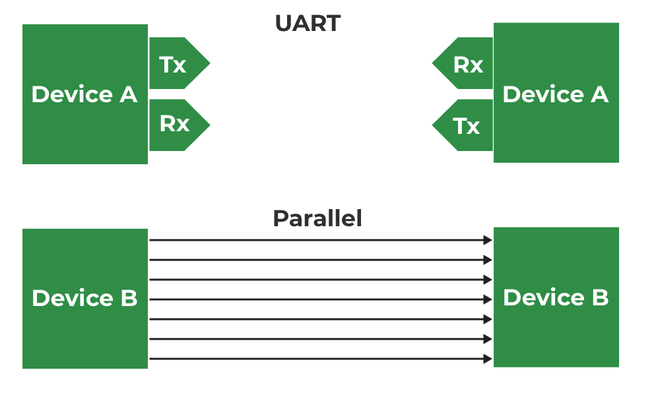
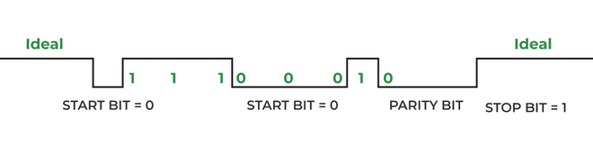

# UART

https://www.geeksforgeeks.org/computer-networks/universal-asynchronous-receiver-transmitter-uart-protocol/

UART is a Universal Asynchronous Receiver Transmitter protocol that is used for serial communication. Two wires are established here in which only one wire is used for transmission whereas the second wire is used for reception. Data format and transmission speeds can be configured here. So, before starting with the communication define the data format and transmission speed. Data format and transmission speed for communication will be defined here and we do not have a clock over here that's why it is referred to as asynchronous communication with UART protocol. Here we will see how this protocol is designed physically.

Here, DEVICE A that is having transmitter PIN and a receiver pin; DEVICE B is having a receiver and transmission pin. The Transmitter of DEVICE A is one that should be connected with the receiver pin of DEVICE B and the transmitter pin of DEVICE B should be connected with the receiver pin of DEVICE A we just need to connect two wires for communication. 

If DEVICE A wants to send data, then it will be sending data on the transmitter’s pin and here receiver of this DEVICE B will receive it over and if DEVICE A wants to receive the data, then that is possible on the RX line that will be forwarded by TX of DEVICE B. On comparing this serial communication of UART with parallel then it can be observed that in parallel multiple buses are required. Based on the number of lines bus complexity of UART is better but parallel communication is good in terms of speed. 

Suppose DEVICE A is sending data to DEVICE B, and the transmitter of DEVICE A will send data to the receiver of Device B then it will be logic high. Now, send the start bit that will be logic 0 and once we have the start bit, DEVICE B will know that somebody is communicating. Now there is the same speed configuration with both devices. So, after the start bit, DEVICE A can forward data.

Consider 8 bits of data length, so we will be forwarding 8 bits and those 8 bits will be received by DEVICE B a parity bit can also be used which is optional, but this is quite effective. By using the parity bit, it can be identified whether the received data is correct or not. Suppose we are sending 1 1 1 0 0 0 1 0. Now, we have 4 ones; an even number of ones are there hence the parity is even and for that, logic 0 will be assigned. Suppose we are receiving data with some error, say zero is converted into one; Now incorrect data that is 1 1 1 1 0 0 1 0 for this incorrect data parity will be 0 as there are 5 ones, here is a mismatch in the parity bit and hence it is confirmed that the received data has some error. 

<pre>
#include < stdint.h >

// Initialize UART
void UART_Init(uint32_t baudrate) {
    // Configure UART peripheral with given baudrate
    // Set word length, stop bits, parity, etc.
    // Enable TX and RX
}

// Send one byte
void UART_SendChar(char c) {
    // Wait until transmit buffer is empty
    // Write c to UART data register
}

// Send a string
void UART_SendString(const char *str) {
    while (*str) {
        UART_SendChar(*str++);
    }
}

// Receive one byte
char UART_ReceiveChar(void) {
    // Wait until data is available
    // Return received byte from UART data register
}
</pre>